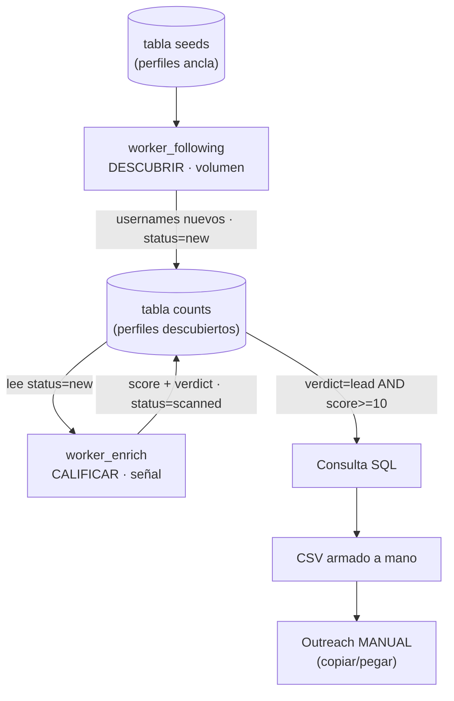
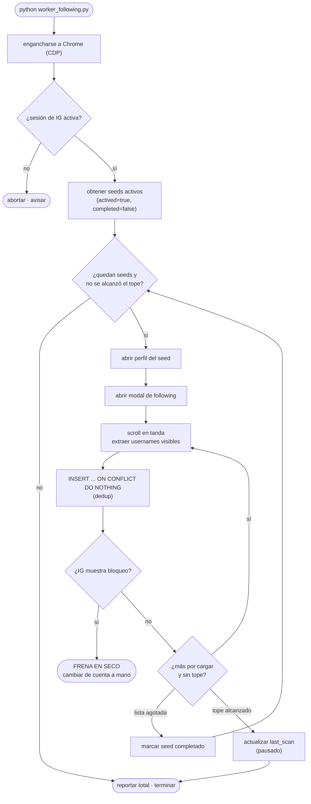
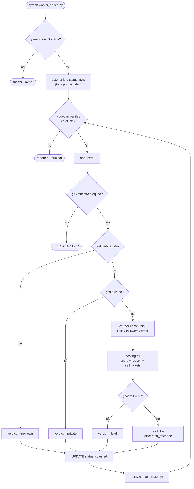
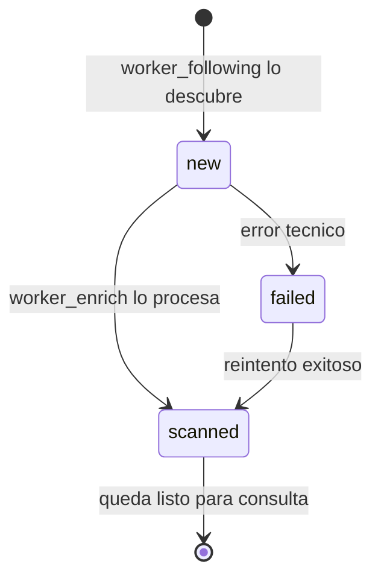
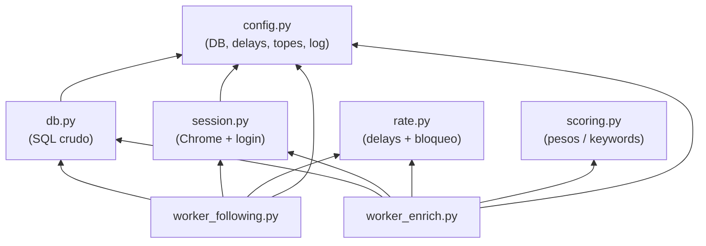

# Arquitectura y flujos — Outreach

Índice:
1. [Pipeline general](#1-pipeline-general)
2. [Flujo de `worker_following` (descubrir)](#2-flujo-de-worker_following-descubrir)
3. [Flujo de `worker_enrich` (calificar)](#3-flujo-de-worker_enrich-calificar)
4. [Estados de una fila en `counts`](#4-estados-de-una-fila-en-counts)
5. [Dependencias entre módulos](#5-dependencias-entre-módulos)

---

## 1. Pipeline general

Dos workers que se coordinan **a través de la base de datos** (sin colas), vía el
campo `status`. `worker_following` produce volumen; `worker_enrich` produce señal.
Con una sola cuenta corren **secuencial**, nunca en paralelo.

---

## 2. Flujo de `worker_following` (descubrir)

Por cada seed activo: abre su lista de *following*, hace scroll en tandas y
guarda usernames nuevos. No lee bios ni puntúa. El **dedup** (`ON CONFLICT`) hace
que repetir sea inofensivo.

---

## 3. Flujo de `worker_enrich` (calificar)

Toma perfiles `status=new` en lotes chicos, los visita una vez, extrae datos,
corre el scoring y guarda el verdict. Es el worker más caro y riesgoso.

---

## 4. Estados de una fila en `counts`

`status` (¿ya lo procesé?) y `verdict` (¿qué es?) son **columnas separadas**: un
privado es `status=scanned` + `verdict=private` sin perder el rastro de que ya se
revisó.

Cuando una fila llega a `status=scanned`, su `verdict` es uno de:

| verdict | significado |
|---|---|
| `lead` | candidato real (`score >= 10`) |
| `discarded_attendee` | escaneado pero no califica |
| `private` | perfil privado (registrado para no re-visitarlo) |
| `unknown` | no existe / no se pudo leer |

---

## 5. Dependencias entre módulos

La lógica delicada (sesión, ritmo) y la configuración viven en módulos
compartidos; los workers quedan delgados. `scoring.py` y `rate.py` no dependen de
nada interno (fáciles de tunear/probar aislados).

